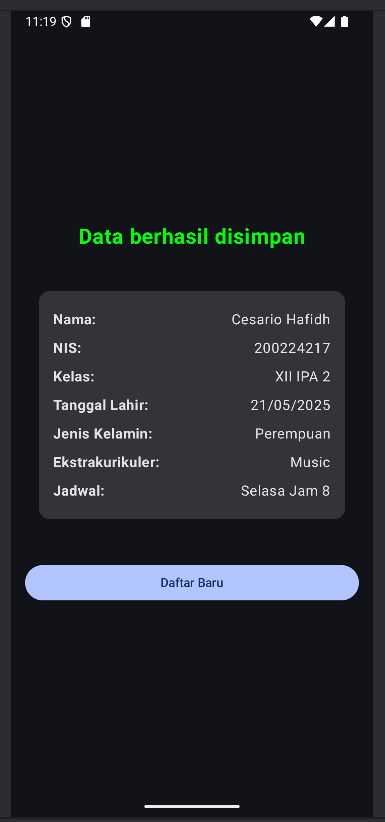

# Mobile Programming Task - Event Handling

**Name:** [Your Name]  
**NIM:** L200224217

## Overview
This Android application demonstrates event handling in mobile applications. It showcases how to capture user inputs, process the data, and display success messages.

## Application Flow

### 1. Initial Screen (Blank Form)
The application starts with a blank form for user input.

### 2. Filled Data
User enters the required information in the form.

### 3. Success Screen
After successful submission, a confirmation message is displayed.

## Implementation Details
This project implements various event handling techniques in Android:
- Button click events
- Input validation
- Form submission
- Success notifications

## Development Environment
- Android Studio
- Kotlin programming language
- Gradle build system

## How to Run
1. Clone this repository
2. Open the project in Android Studio
3. Build and run the application on an emulator or physical device
